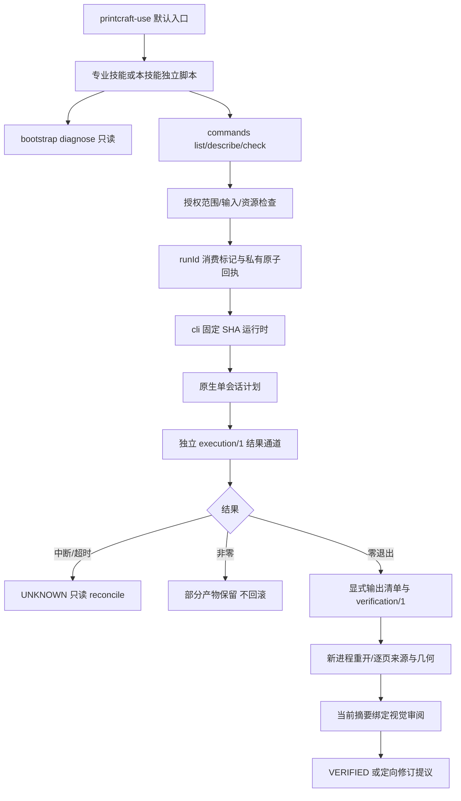

# PrintCraft 技能源实施验收（2026-10-08）

> 以下为开发阶段历史验收记录。最新 dev.5 发行身份、任务状态和当前宿主证据以 [发布验收记录](release-2026-10-08.md) 为准；历史版本/命令不改写。

当前候选 0.1.0-dev.3；OpenSpec change: harden-printcraft-skill-execution。已完成本机执行层、六项技能、PDF 验收与协议交接，**35/38 项任务已完成**。剩余专项环境/真实集成和最终归档门禁不删除、不降级。

## 已实现与调用关系



- 六项独立技能，各带 references/examples/agents 元数据与七项执行资源。use 默认隐式路由，专业入口显式保留；按名称交接，不读取兄弟技能路径。
- 独立 execution/1 通道保留 UNKNOWN、阶段、退出码及部分日志；query 120s，edit 600s，render/run 1800s，MCP/UI 无普通截止。MCP stdout 不混入包装 JSON。
- runId 注册表位于任务输出父目录 `.printcraft-runs`，O_EXCL 消费身份，任务锁、原子状态、attempted 及摘要在原生编辑前落盘。丢失或损坏回执不重新初始化；不是跨任务根的全局 exactly-once。
- status/reconcile 不发起编辑，核对身份/回执摘要、现存产物及可观察 PID。PID 存在不证明身份一致，不把后代未确认终止描述为已确认停止。
- --input 原件与执行资源前后比对；优先工作副本。--allow-scope 复用确认过的 overwrite:路径/print 范围；缺少新覆盖或打印授权时提前拒绝。已知工具范围检查不是全文件系统沙箱。
- 私有计划/结果通道及回执 0600，已知敏感字段在公开诊断中脱敏；避免脱敏破坏 SHA 身份。可捕获退出后清理私有计划/结果，硬崩溃残留仍需核对。
- 输出清单分别记录角色、规范路径、媒体类型、大小、SHA；回执目录不是业务输出目录。verification/1 绑定输入/候选/规则，检查页数、逐页文本、来源页映射及几何，新进程重开后仍需视觉审阅。

## 测试与实际证据

| 层 | 实际结果 | 证据 |
|---|---|---|
| 本地回归 | 52/52 PASS | handoff-local-tests.log；tests/test_*.py |
| 独立仓库 | 缺少兄弟项目仍 PASS | isolated-repository.json |
| 包与资源 | 六项完整、共享资源一致、单技能含中文/空格路径 PASS | scripts/validate_package.py、sync_skill_resources.py；test_package.py |
| 固定冷安装 | printcraft-cli 0.2.1 / macOS arm64 PASS | installation-receipt.json |
| 真实目录 | 123 项工具，新增/移除工具检测 PASS | artifacts/native-0.2.1-tools.json、docs/tool-coverage.json |
| 原生样例 | 11 项场景断言 PASS，OCR 状态另计 OBSERVED | artifacts/native-report.json |
| 确定性与视觉 | 当前五项候选 VERIFIED（原创夹具范围） | verification-receipt.json、visual-review.json、combined-verification.json |
| 扫描件 | 图像 PDF 空文本被分类为需 OCR/意图审阅 | scan-request.json、scan-receipt.json |
| MCP | 真 initialize JSON-RPC/EOF 退出；显式停止 UNKNOWN | artifacts/mcp-*.json |
| 实际中断 | 已保存部分 PDF，回执及 reconcile 保持 UNKNOWN | artifacts/interrupted-receipt.json、interrupted-reconcile.json |
| 插件与模型 | Codex 0.153.4 / gpt-5.6-sol 实际技能调用和页面任务 PASS | 插件 docs/verification/；与本项目证据分层 |

本地校验函数返回 nativeInstallation/modelDispatch=NOT_RUN 表示该次静态函数没有运行原生或模型，不否认单独保存的实际证据。

固定归档 SHA-256：bda65829033916c5de5a7ddc0763437f8db2e8792ee43c8dc2676434acb3d495；二进制 SHA-256：b7783b596870ed5a326f29456d4647382d2e1e4d7b7ffe75ded192cd15b86995。没有用 research 源码构建替代固定制品。

## 缺陷与红灯边界

实施前来源反向用例实际暴露了五类错误输入被接受；执行通道回归暴露 UNKNOWN 丢失。后续自审补上 Harness CLI 显式参数被 REMAINDER 吞掉、脱敏可能破坏指纹、回执丢失后复用身份、输出缺失仍零退出等回归。

legacy-exit-only-red.log 使用**重建的旧退出码分支**和真实 gateway→cli→native 进程关系，把超时缩至夹具 0.5s，实际出现 FAILED_OR_PARTIAL != UNKNOWN；这是旧逻辑的敏感性基线，不是不存在的旧 Git 提交快照，也不是实际等待 600s。正常分支的同一进程回归为绿灯。新增模块最初缺失的 ImportError 不作为行为红灯证据。

主要回归：test_execution_hardening（真实两层超时、服务停止、互斥、秘密/指纹、授权）；test_gateway_receipts（输入漂移、输出缺失、身份/回执损坏）；test_pdf_verification（顺序、空文本、规则/候选漂移、交接拒绝）；test_runtime_names/diagnostics（损坏安装、平台、离线及并发安装）；test_snapshot_sync（拒绝保持原文件、本地 Harness 边界）。

## 专项语义与剩余门禁

- 表单：真实保存重开字段值，渲染可见 verified form。
- 脱敏：目标文本提取不存在，原始标记对象字节不存在，渲染只余遮挡；限本次原创样例，不以黑框独自证明任意 PDF 安全。
- 签名：实际创建/签署/重开，signed=1，modification=none；自签名证书未受信任，status=unknown/all_valid=false，不能报告签名有效。
- PDF/A：仅原生 2b 结构子集违规报告，不宣称完整符合性或独立认证。
- OCR：available=false，仅 languages=[en]，未安装模型；中文 OCR 与其他平台需要真实语言/模型/设备证据，任务 7.2 开放。
- ArtCraft：候选协议/摘要/producer 版本拒绝有单测，默认夹具版本 1.0.0 不代表真实生产者已兼容。新增真实 ArtCraft 0.1.0-dev.113-runtime.1 + VectorCraft 0.2.0-craft.2 → PrintCraft 0.2.1 验收，验证源工程选择性返工、独立节点复用、PDF 合并/单页裁剪及本机目录移动；手机/平板与跨机器仍未验证，任务 7.4 开放。详细证据见 cross-plugin-2026-10-08.md。
- 全部门禁未满足，7.5 中最终主规格同步/归档开放；没有为关闭任务缩减规格。

## 实际命令与环境

Python 本地测试使用 /opt/homebrew Python 3.14.3；另用 /opt/anaconda3 Python 3.13.5/Pillow 对原生 PAM 做无像素改动的 PNG 转换供视觉检查，没有安装额外库。固定运行时实际位于隔离中文/空格路径。

```bash
python3 -I -B -m unittest discover -s tests
python3 -I -B scripts/validate_package.py
python3 -I -B scripts/sync_skill_resources.py --check
python3 scripts/check_tool_coverage.py --catalog <实际123项目录>
python3 tests/native_acceptance.py --runtime-home <隔离运行时> --workdir <全新验收目录>
python3 skills/printcraft-use/scripts/commands.py verify docs/verification/verification-request.json --runtime-home <隔离运行时>
openspec validate harden-printcraft-skill-execution --strict
python3 scripts/evidence.py --check docs/verification/evidence-index.json
```

OpenSpec CLI 实际版本 1.8.0。strict 验证仅证明增量规范格式有效。主 specs 未同步、change 未归档。两个项目仍无 .git/远端；没有提交、CI、正式发布或市场登记。

本次补充：新增显式跨仓验收脚本后，基础 unittest 再次实际执行 51/51 PASS（3.502s）。六项分发技能及原生锁未改变，原宿主/模型证据仍仅适用于它们原来测试的场景。修改前报告和索引保存在 history/pre-cross-plugin-2026-10-08/；新证据不覆盖旧报告。开放门禁的可审核后续操作见 remaining-gates-2026-10-08.md。

## dev.3 当前复验

公开只读 handoff 入口、插件委托和明确版本拒绝已实现，六项受控快照同步，旧版本证据保留。当前技能源 52/52、插件 12/12、独立副本及 11 项真实原生场景通过。新 Codex 安装缓存为 dev.3，plugin/read 实际发现七项技能；gpt-5.6-sol 实际完成自然语言检查及显式交接/PDF 重排、保存重开，69 项缓存技能文件与当前插件一致。模型产物三页经过当前摘要绑定的独立图像审阅，范围只限原创夹具。

技能源当前证据见 handoff-entry-dev3.md、native-handoff-dev3-report.json、cross-plugin-public-artifacts/；插件当前证据见 plugin-read-dev3.json、model-handoff-dev3-binding.json、model-handoff-*-dev3.jsonl 和 model-handoff-dev3-artifacts/。表中未加 dev.3 的旧模型、更新和 PDF 报告是历史场景，不自动变成当前版本的完整证明。中文、其他平台、移动端及 Git/发行门禁仍开放，任务数没有虚增。
