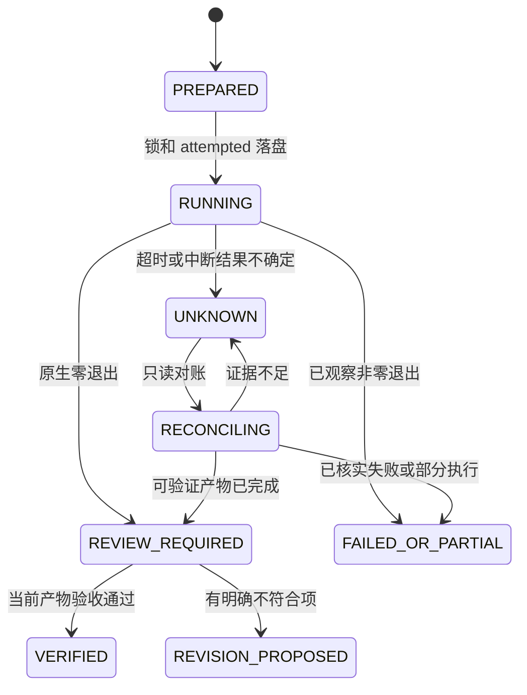

## Context

2026-10-08 基线：六项技能、每项五份相同运行资源；版本 0.1.0-dev.1，锁定 printcraft-cli 0.2.1 / darwin-arm64。已有 22 项本地测试通过，但没有原生或宿主验收。本次观察到 cli.py 600 秒超时产生 unknown，command_gateway.py 按非零退出误记 FAILED_OR_PARTIAL；基础测试中快照测试依赖兄弟插件。

参考 Dreamina：唯一隐式路由、专业技能的 references/examples、命令所属清单、状态损坏拒绝、产物摘要和验收回执绑定。参考其当前 0.4.3 代码模式，不把历史付费/宿主 PASS 作为 PrintCraft 证据，不复制积分报价与远端恢复协议。

## Goals / Non-Goals

目标：保留独立技能安装和固定制品保护，形成可解释、可对账、可验收的本地 PDF 工作流。

非目标：本规格交付不实施代码、不升级原生版本、不初始化 Git、不运行真实打印/签名、不创建远端或发布；不要求新增六项以外的领域技能。OCR、签名、PDF/A、其他平台和跨插件能力列入专项验收任务，未通过不开放声明，不能以占位实现关闭。

## Decisions

### 1. 源码拥有公共契约，插件只消费

本 change 的 execution-lifecycle 和 pdf-delivery-verification 拥有执行结果、任务状态及验收语义。插件 `harden-printcraft-plugin-delivery` 只负责适配、显示与分发。跨项目引用为规范依赖，不转化为安装后读取开发目录。

运行资源维持每技能自包含；维护时使用统一来源/生成或受控同步并验证字节一致，避免手工修六份。暂不引入共享外部 Python 包，以免破坏独立安装。

### 2. 最小版本化协议

计划继续保留 domain/steps 结构，新增字段不得静默放宽已有参数拒绝。执行包装结果使用单独结果文件/描述符，不污染 native stdout 或 MCP 流；契约标识为 `printcraft.execution/1`。任务记录至少包含 runId、contractVersion、attempted、计划/输入/运行时/资源摘要、预期输出、开始/结束时间、阶段结果和可诊断错误。

验收契约标识为 `printcraft.verification/1`，包含 runId、候选摘要、规则版本、检查范围、各检查结论与未验证项。JSON 契约文件在实施阶段创建并验证；此设计不是已存在 API 声明。

普通成功执行仍返回退出码 0，但状态保留 REVIEW_REQUIRED 直到验收通过；FAILED_OR_PARTIAL、UNKNOWN 和输入漂移均非零。旧 cli.py 透传入口维持原生退出兼容，新结构化结果为网关提供确定分类。原生查询失败与编辑未知必须区分。

### 3. 本地任务状态与恢复

runId 只解决追踪和同任务互斥，不提供全局 exactly-once。进程内 Document ID 不能跨重启复用；需要后续写入时先形成明确对账结论、工作副本和修订记录。不得在 UNKNOWN 状态直接重跑整份原生脚本。子进程组是否停止单独记录，不根据父进程超时推断。

### 4. 输入、输出及秘密

保留显式 --input 保全机制，技能流程主动登记需保持的原始 PDF；不能通用猜测所有参数字符串都是路径。工作副本和输出按任务目标确定，真实打印/覆盖原件是独立副作用。回执目录不等同于输出根目录。

公开证据使用脱敏信息；必要秘密放受限临时执行材料，测试权限和清理。不得记录可穷举秘密的单独明文或无保护校验值；关联材料应在安全范围内绑定身份。某原生版本仅接受 argv 时如实记录该边界，不声称环境变量自动解决所有暴露。

### 5. 验收组合与证据分层

优先确定性断言，再做相关页面的视觉检查；保存重开必须在新的原生会话验证。视觉评价可由宿主或人工提供，必须绑定候选摘要，不能只导入自由文本“通过”。TRACE 仅用于技能质量，不代替模型路由和 PDF 正确性。

## Risks / Trade-offs

- 固定发行版可能没有所需检查接口 → 先做真实能力发现，报告未支持，不从最新源码臆造命令；需要原生变更时另建对应项目变更。
- 进程退出与文件落盘存在不确定窗口 → attempted 先落盘、禁止未知重放、输出独立重开对账。
- 校验结果不能完整证明复杂 PDF 语义 → 明确任务检查范围，高级能力专项门禁保留未完成。
- 六份资源易漂移 → 同源生成/同步与全资源摘要检查，同时保持单技能运行测试。
- 历史回执不足以恢复 → 旧记录只读兼容，不自动补造身份或重置状态。

## Migration Plan

先完成 P0 失败回归与协议适配，再完善技能/验收，最后执行授权的原生与宿主验证。新契约以版本区分，旧任务保留只读查看；回退代码不得删除新状态。将已验证的技能源通过保护性同步交给插件，插件自身门禁独立完成后才考虑发行。

本 change 不执行 sync/archive；实施及所需验收完成后再同步到主规格。P3 项若受外部能力阻塞须保持开放，不通过减少验收范围将本 change 标记全部完成。

### 7.2 的平台验收执行补充

本机无法运行的 CPU/OS 可使用 GitHub 托管的真实对应平台运行器。作者验收程序只解包摘要固定的官方 0.2.1 制品，核对精确 CLI 成员及二进制摘要，记录运行器 OS/CPU、源码提交、实时目录、输入与输出摘要、保存后新进程重开结果。运行结果与工作流原始日志作为独立证据保存。

此程序属于原生平台专项验收，不改变六项技能当前仅 darwin-arm64 的安装锁，也不把直接执行二进制等同于独立技能安装支持。中文识别、语言模型和手机/平板各自门禁继续保留，其他平台执行成功不自动关闭 7.2。

英语 OCR 通过显式验收参数启用：按固定上游 ATTRIBUTION.toml 的 URL、两个模型摘要及 CC-BY-SA-4.0 归属下载到验收 CLI 同级 models/，模型不随技能或证据包分发。先将原创文字 PDF 渲染后封装为无文本图像 PDF，证明原件无文本，再识别、保存并以新进程提取目标标记；禁止已有文字跳过 OCR 造成假通过。记录无模型/有模型两次状态和输入不变性。作者验收源文件固定 LF 换行，使 Windows 检出指纹与 Git 文件字节一致。

### 7.4 的跨机器交付验收补充

使用已由真实 ArtCraft/VectorCraft 生成并归档的完整 v1/v2 项目包与返工 PDF，保留原始 producer 版本及清单/文件摘要。独立 macOS 发送作业打包并上传 Actions artifact，Linux 和 Intel Mac 接收作业从该 artifact 下载至新位置；固定 ArtCraft 消费者源码提交，调用官方 verify-package，验证文件表、源工程和 portable plan 引用。PrintCraft 公共 handoff 入口验证原 producer 版本与 PDF 摘要，固定原生 0.2.1 在接收机重开、渲染，并仅裁剪目标页，断言另一页渲染不变、全部传入文件不变。

记录发送/接收作业及真实 OS/CPU、传输 ZIP 摘要、官方验包输出、命令、工具和原生摘要、输入及新产物摘要。它是跨机器文件/项目包交付证据，不表示在接收机重新运行 ArtCraft 的过期原工作流，也不替代手机/平板交付、宿主路由或技能安装器的平台验收；7.4 仍须等待其剩余门禁。
